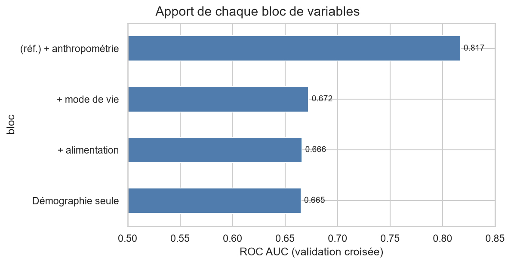

# Risque cardiométabolique et habitudes de vie — NHANES


Prédiction du **syndrome métabolique** à partir des données d'enquête de santé
et de nutrition **NHANES** (National Health and Nutrition Examination Survey,
CDC / États-Unis), et identification des facteurs alimentaires et de mode de vie
les plus associés au risque.

> **À propos de ce projet.** Docteur en biotechnologie alimentaire, j'ai travaillé
> en R&D nutraceutique (actifs issus de microalgues, lipides, formulation). Ce
> projet applique une chaîne machine learning complète à une question que je
> connais côté biologie : *quels apports nutritionnels et quels comportements
> pèsent le plus dans le risque cardiométabolique, et peut-on le prédire ?*
> L'objectif n'est pas seulement d'obtenir un bon score, mais de rendre chaque
> choix méthodologique explicite et défendable.



*À âge et catégorie sociale donnés, l'alimentation déclarée n'ajoute presque rien
au pouvoir prédictif. Le résultat central du projet — détaillé au notebook 05.*

---

## Le jeu de données

**NHANES** est une enquête transversale du CDC, menée par cycles de 2 ans sur un
échantillon représentatif de la population des États-Unis. Chaque participant
passe un entretien à domicile **et** un examen médical mobile (prises de sang,
mesures anthropométriques, tension). Les données sont dans le **domaine public**.

**Cycles utilisés** : 2013-2014 (`_H`), 2015-2016 (`_I`), 2017-2018 (`_J`)
→ **29 400 participants**, ramenés à **5 521** adultes du sous-échantillon à jeun,
sans diabète ni maladie cardiovasculaire déjà diagnostiqués (le journal des
exclusions est dans le notebook 02).

**Composants fusionnés** (un fichier `.XPT` par composant et par cycle, jointure
sur l'identifiant `SEQN`) :

| Fichier | Contenu |
|---------|---------|
| `DEMO` | âge, sexe, origine, revenu, niveau d'éducation, pondérations d'enquête |
| `BMX` | tour de taille, IMC, mesures anthropométriques |
| `BPX` | tension artérielle (systolique / diastolique) |
| `GHB` | hémoglobine glyquée (HbA1c) |
| `GLU` | glycémie à jeun |
| `HDL`, `TRIGLY`, `TCHOL` | bilan lipidique |
| `DR1TOT` / `DR2TOT` | rappels alimentaires 24 h : énergie, macronutriments, fibres, sucres, sodium, acides gras saturés / mono / poly-insaturés, cholestérol alimentaire… |
| `PAQ` | activité physique (fréquence, intensité, sédentarité) |
| `SMQ`, `ALQ` | tabac, alcool |
| `SLQ` | sommeil |
| `DIQ`, `MCQ`, `BPQ` | antécédents déclarés (diabète, maladies cardiovasculaires, HTA) — pour exclure les cas déjà diagnostiqués/traités |

**Volumétrie** : ~130 Mo de fichiers bruts (17 composants × 3 cycles). Données
réelles et « sales » : valeurs manquantes structurelles, codes spéciaux
`7`/`9`/`77`/`99`, questionnaires alcool et sommeil qui changent entre cycles,
0 qui ressortent en `5e-79` après lecture du format XPT.

---

## La cible : syndrome métabolique (NCEP ATP III)

Le syndrome métabolique est défini par la présence d'**au moins 3 des 5 critères**
suivants — tous calculables depuis NHANES :

| Critère | Seuil (adulte) |
|---------|----------------|
| Tour de taille élevé | ≥ 102 cm (homme) / ≥ 88 cm (femme) |
| Triglycérides élevés | ≥ 150 mg/dL |
| HDL-cholestérol bas | < 40 mg/dL (homme) / < 50 mg/dL (femme) |
| Tension élevée | ≥ 130 / 85 mmHg |
| Glycémie à jeun élevée | ≥ 100 mg/dL |

C'est une **cible construite, pas fournie** : sa dérivation est une partie du
travail (notebook 02). **Prévalence obtenue : 32,5 %** → classification modérément
déséquilibrée, réaliste. Les critères « tension » et « glycémie » comptent aussi
comme remplis si la personne est traitée (définition harmonisée 2009).

**Fuite de données** : les variables qui *servent à définir* la cible (tour de
taille, IMC, triglycérides, HDL, tension, glycémie, HbA1c, traitements) sont
exclues des features — vérifié par une assertion dans `src/features.py`. Le modèle
prédit à partir de l'**alimentation, l'activité, le sommeil, le tabac/alcool et la
démographie uniquement**.

---

## Pipeline

| Notebook | Étape | Points clés |
|----------|-------|-------------|
| `01_acquisition_donnees` | Téléchargement des `.XPT` CDC, cache local | 17 composants × 3 cycles |
| `02_table_analyse` | Jointure `SEQN`, harmonisation inter-cycles (alcool, sommeil), recodage du manquant, **construction de la cible** | codes spéciaux → NaN ; artefact des 0 en `5e-79` ; exclusion diabète/MCV ; critères NCEP |
| `03_exploration` | Descriptif, prévalence par sous-groupe, distributions d'apports cas/témoins, corrélations | rôle des pondérations d'enquête discuté |
| `04_modele_reference` | Régression logistique, split stratifié, pipeline `scikit-learn`, CV | métrique de suivi : average precision ; lecture des odds ratios |
| `05_ensembles_apport_shap` | Random forest, gradient boosting, **apport incrémental de chaque bloc de variables**, SHAP | le résultat central du projet ; évaluation finale sur le test |
| `06_sous_groupes_limites` | Performance par sexe, âge, origine ; limites ; conclusion | le modèle est-il aussi bon pour tous ? |
| `07_reseau_neurones` | MLP tabulaire (Keras 3 / backend PyTorch), pré-traitement commun, arrêt anticipé | le deep learning apporte-t-il quelque chose ? (non, ici) |

Fonctions réutilisables dans [`src/`](src/) ; tests dans [`tests/`](tests/) ;
synthèse rédigée dans [`reports/synthese.md`](reports/synthese.md).

---

## Résultats

- **Comparaison des modèles** : la régression logistique (ROC AUC ≈ 0,68 en CV)
  fait aussi bien que random forest, gradient boosting et un réseau de neurones —
  signal faible et monotone, rien à gagner en complexité.
- **Apport par bloc** : la démographie seule atteint ROC AUC ≈ 0,665 ;
  l'alimentation déclarée n'ajoute presque rien (+0,001), le mode de vie un peu
  plus (+0,007). Le tour de taille et l'IMC feraient monter à ≈ 0,82 — mais ils
  sont à moitié la définition de la cible.
- **Conclusion** : *à âge et catégorie sociale donnés, l'alimentation et le mode
  de vie déclarés n'expliquent presque pas qui présente un syndrome métabolique.*
  Résultat en creux mais net et stable sur trois cycles — deux rappels de 24 h
  sont un instrument trop grossier pour ce lien, qui passe par l'adiposité et des
  années d'habitudes.

---

## Compétences démontrées

- **Data engineering** — récupération et fusion de ~15 fichiers hétérogènes,
  harmonisation de 3 cycles d'enquête, gestion rigoureuse du manquant et des
  codes spéciaux.
- **Cadrage métier** — cible construite à partir d'une définition clinique
  (NCEP ATP III), features choisies pour répondre à une question actionnable,
  prévention explicite de la fuite de données.
- **Machine learning** — pipeline `scikit-learn` propre, baseline interprétable
  puis modèles d'ensemble, calibration, choix de métrique adapté au déséquilibre.
- **Deep learning** — MLP tabulaire sous Keras 3, comparé au reste sur le même
  protocole (notebook 07).
- **Interprétabilité & équité** — SHAP, importance de permutation, analyse de
  performance en sous-groupes.
- **Communication** — notebooks narrés et figures lisibles pour un public
  nutrition / santé comme technique.

---

## Reproduire l'analyse

```bash
python -m venv .venv
.venv/Scripts/pip install -r requirements.txt      # Windows ; ailleurs : .venv/bin/pip
KERAS_BACKEND=torch .venv/Scripts/jupyter lab     # backend torch pour le notebook 07
# exécuter les notebooks dans l'ordre (01 → 07)
```

Les données NHANES sont téléchargées et mises en cache dans `data/raw/`
(non versionné) au premier lancement du notebook 01. Python 3.14 ; versions
figées dans [`requirements.txt`](requirements.txt).

---

## Sources

- CDC / NCHS — **NHANES**, cycles 2013-2014, 2015-2016, 2017-2018.
  <https://wwwn.cdc.gov/nchs/nhanes/> — données du domaine public.
- Grundy SM *et al.* **Diagnosis and Management of the Metabolic Syndrome.**
  *Circulation* (2005) — critères NCEP ATP III révisés.
- Alberti KGMM *et al.* **Harmonizing the Metabolic Syndrome.** *Circulation* (2009).

Code publié sous licence MIT.
